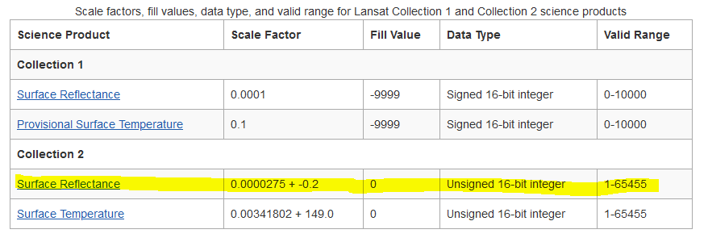
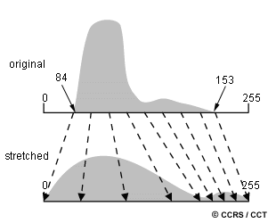

# Capitulo8_Tecnicas_calsificacion_Imagenes

## 1. VISUALIZACIÓN DE IMÁGENES

En el presente ejercicio se va a aprender a visualizar y manipular imágenes satelitales, además de a operar con ellas para generar índices de vegetación empleando el lenguaje R. Se utilizarán las imágenes descargadas en el ejercicio anterior.  

### 1.1. Exploración de la imagen

Primero se va a aprender a visualizar y manejar las imágenes de satélite, intentando comprender la organización interna de las mismas, cómo se configura la estructura de sus datos y la información que aportan del terreno.

#### 1.1.1 Preparación de los datos en el entorno RStudio Cloud
 
Como se ha explicado, el satélite Landsat 5 TM, opera en las siguientes bandas:  

|Nº de Banda  |Nombre de Banda    |Longitud de onda    |Resolución |
|-------------|-------------------|--------------------|-----------|
|Band 1       |Azul               |(0.45 - 0.52 µm)    | 30 m      |
|Band 2       |Verde              |(0.52 - 0.60 µm)    | 30 m      |
|Band 3       |Rojo               |(0.63 - 0.69 µm)    | 30 m      |
|Band 4       |Infrarrojo cercano |(0.76 - 0.90 µm)    | 30 m      |
|Band 5       |Infrarrojo cercano |(1.55 - 1.75 µm)    | 30 m      |
|Band 6       |Infrarrojo térmico |(10.40 - 12.50 µm)  |120 m      |
|Band 7       |Infrarrojo medio   |(2.08 - 2.35 µm)    | 30 m      |

##### Archivos de las bandas

Las bandas Landsat individuales para una escena se colocan en archivos GeoTIFF separados que se distinguen por el final de sus nombres. Por ejemplo, para los datos de Landsat 5 nivel 2 (LT05_L2SP), ruta 200 y fila 34 (200034), del 29 de marzo de 1993 (19930329), los siguientes archivos son archivos de datos para las diferentes bandas:

- LT05_L2SP_200034_19930329_20200914_02_T1_SR_B1.TIF (azul)  
- LT05_L2SP_200034_19930329_20200914_02_T1_SR_B2.TIF (verde)  
- LT05_L2SP_200034_19930329_20200914_02_T1_SR_B3.TIF (rojo)  
- LT05_L2SP_200034_19930329_20200914_02_T1_SR_B4.TIF (infrarrojo cercano 1)  
- LT05_L2SP_200034_19930329_20200914_02_T1_SR_B5.TIF (infrarrojo cercano 2)  
- LT05_L2SP_200034_19930329_20200914_02_T1_SR_B6.TIF (infrarrojos térmicos)
- LT05_L2SP_200034_19930329_20200914_02_T1_SR_B7.TIF (infrarrojos medio)  

Por otro lado, se proporcionan archivos GeoTIFF adicionales conn información más detallada sobre los datos y el procesamiento de datos.  
    
- LT05_L2SP_200034_19930329_20200914_02_T1_ANG.txt: Archivo con los coeficientes angulares de la imagen  
- LT05_L2SP_200034_19930329_20200914_02_T1_MTL.json: Archivo de metadatos de la imagen en formato JavaScript  
- LT05_L2SP_200034_19930329_20200914_02_T1_MTL.txt: Archivo de metadatos de la imagen en formato txt  
- LT05_L2SP_200034_19930329_20200914_02_T1_MTL.xml: Archivo de metadatos de la imagen en formato xml  
- LT05_L2SP_200034_19930329_20200914_02_T1_QA_PIXEL.TIF: Banda de ajuste de calidad de píxeles  
- LT05_L2SP_200034_19930329_20200914_02_T1_QA_RADSAT.TIF: Saturación radiométrica y banda QA de oclusión del terreno  
- LT05_L2SP_200034_19930329_20200914_02_T1_SR_ATMOS_OPACITY.TIF: Banda de opacidad atmosférica
- LT05_L2SP_200034_19930329_20200914_02_T1_SR_CLOUD_QA.TIF: Calidad de la reflectancia superficial creada durante el procesado
- LT05_L2SP_200034_19930329_20200914_02_T1_ST_ATRAN.TIF: Banda de transmitancia atmosférica
- LT05_L2SP_200034_19930329_20200914_02_T1_ST_CDIST.TIF: Distancia en kilómetros de cada píxel a la nube más cercana de la banda QA_PIXEL  
- LT05_L2SP_200034_19930329_20200914_02_T1_ST_DRAD.TIF: Banda térmica de radiancia ascendente  
- LT05_L2SP_200034_19930329_20200914_02_T1_ST_EMIS.TIF: Emisividad de superficie estimada de los archivos ASTER GED  
- LT05_L2SP_200034_19930329_20200914_02_T1_ST_EMSD.TIF: Desviación estándar esperada de la emisividad de superficie estimada  
- LT05_L2SP_200034_19930329_20200914_02_T1_ST_QA.TIF: Incertidumbre en la temperatura de superficie
- LT05_L2SP_200034_19930329_20200914_02_T1_ST_TRAD.TIF: Banda térmica de nivel 1 convertida en radiancia de superficie térmica  
- LT05_L2SP_200034_19930329_20200914_02_T1_ST_URAD.TIF: Banda térmica de radiancia ascendente  
- LT05_L2SP_200034_19930329_20200914_02_T1_thumb_large.jpeg: Visualización rápida de la imagen en tamaño grande  
- LT05_L2SP_200034_19930329_20200914_02_T1_thumb_small.jpeg: Visualización rápida de la imagen en tamaño pequeño  

Se puede profundizar aún más con [la guía de los porductos Landsat 4-7 de la colección 2, nivel 2](https://d9-wret.s3.us-west-2.amazonaws.com/assets/palladium/production/s3fs-public/media/files/LSDS-1618_Landsat-4-7_C2-L2-ScienceProductGuide-v4.pdf). 

Se procede a leer la imagen en cada una de las bandas. Primero se activa la librería necesaria. 

```r
# Leer cada una de las bandas de la imagen 
# Azul
b1<-raster('C:/DESCARGA/LANDSAT_PREFIRE/LT05_L2SP_200034_19930329_20200914_02_T1_SR_B1.TIF') #Adaptar a la ruta de descarga utilizada
# Verde
b2<-raster('C:/DESCARGA/LANDSAT_PREFIRE/LT05_L2SP_200034_19930329_20200914_02_T1_SR_B2.TIF') #Adaptar a la ruta de descarga utilizada
# Rojo
b3<-raster('C:/DESCARGA/LANDSAT_PREFIRE/LT05_L2SP_200034_19930329_20200914_02_T1_SR_B3.TIF') #Adaptar a la ruta de descarga utilizada
# Infrarrojo cercano 1
b4<-raster('C:/DESCARGA/LANDSAT_PREFIRE/LT05_L2SP_200034_19930329_20200914_02_T1_SR_B4.TIF') #Adaptar a la ruta de descarga utilizada
# Infrarrojo cercano 2
b5<-raster('C:/DESCARGA/LANDSAT_PREFIRE/LT05_L2SP_200034_19930329_20200914_02_T1_SR_B5.TIF') #Adaptar a la ruta de descarga utilizada
# Infrarrojo lejano
b7<-raster('C:/DESCARGA/LANDSAT_PREFIRE/LT05_L2SP_200034_19930329_20200914_02_T1_SR_B7.TIF') #Adaptar a la ruta de descarga utilizada
```

Cuando se imprimen las variables con las que se han introducido las bandas, se pueden obtener las características de las mismas.  

```r
# Impresión de variables 
b1
```
De aquí se puede obtener información, como la resolución espacial de la imagen **resolution** (30x30m de tamaño de pixel), la extensión que ocupa **extent** (con sus coordenadas máximas y mínimas en x e y), el sistema de coordenadas de referencia **crs** (en este caso, el elipsoide WGS84 en sistema proyectado UTM y en la zona 30 Norte, que corresponde con el código EPSG 32630) o los valores máximos y mínimos de los píxeles **values** (en 16 bits=$\2^{16}$). Fíjate en el sistema de referencia que utiliza la imagen. Será necesario recordarlo en el siguiente paso.  

#### 1.1.2 Recorte de la zona de interés  
Se debe tener en cuenta que los rásteres suelen ser archivos que consumen una cantidad considerable de espacio en disco, memoria y ancho de banda de conexión. Las limitaciones de memoria RAM de la aplicación RStudio Cloud, obliga a realizar primeramente un recorte de las imágenes por la zona de estudio.  

```r
#Leer la zona de estudio donde se produjo el incendio
library(sf)
Limites.AOI<-st_read("C:/DESCARGA/Limites_AOI.shp") #Adaptar a la ruta donde se han descargado los archivos shapefile Limites_AOI
```

Para que se pueda realizar el corte de la imagen, es necesario que tanto el shape, como la imagen estén en el mismo sistema de referencia. Por eso, es necesario.

```r
#Extensión de los límites de la zona de estudio.
#Notese que el sistema de coordenadas es geográfico
extent(Limites.AOI)

#Transformación al sistema de coordenadas proyectadas WGS84 UTM 30N de la zona de estudio
Limites.AOI<-st_transform(Limites.AOI,crs = 32630)

#Comprobación de que los límites de la zona de estudio tienen el sistema de coordenadas nuevo
extent(Limites.AOI)

#Recorte de la imagen Landsat por la extensión de la zona de estudio
b1<-crop(b1,extent(Limites.AOI))
b2<-crop(b2,extent(Limites.AOI))
b3<-crop(b3,extent(Limites.AOI))
b4<-crop(b4,extent(Limites.AOI))
b5<-crop(b5,extent(Limites.AOI))
b7<-crop(b7,extent(Limites.AOI))
```

Observando la propiedad de **values** de las bandas de la imagen, puede verse que varía entre 0 y 65.535, es decir, está descrita en valores de 16 bits. Normalmente, los valores de reflectividad describen la fracción de radiación incidente que es reflejada por una superficie en valores de 0, cuando no refleja nada, a 1, cuando refleja toda la energía incidente. Para evitar que los valores decimales de la fracción saturen la capacidad de almacenamiento de la imagen, se utiliza un factor de escalado, que transforman los valores para que queden circunscritos en 16 bits. Para transformarlos a cantidades entre 0 y 1 se utiliza un factor de escala, cuya ecuación es:  
$$Pixel[0-1] = (Pixel [0-65535]* 0.0000275) - 0.2$$

 
[Fuente](https://www.usgs.gov/faqs/why-are-fill-values-and-scaling-factors-landsat-collection-2-level-2-products-different-those?qt-news_science_products=0#qt-news_science_products)  

Ejecutamos, por tanto, la transformación de los datos a valores de reflectividad usando el factor de escala proporcionado.  
```r
#Transformacion con factor de escala
b1<-(b1*0.0000275)- 0.2
b2<-(b2*0.0000275)- 0.2
b3<-(b3*0.0000275)- 0.2
b4<-(b4*0.0000275)- 0.2
b5<-(b5*0.0000275)- 0.2
b7<-(b7*0.0000275)- 0.2
```

#### 3.1.2 Estadísticas de la imagen

Para comprobar el resultado visualiza el **histograma** que permite comprender la estadística de la imagen y las **bandas**:   
Obtención del **histograma**.  

```r
# Histograma de valores
par(mfrow=c(2,3))
hist(b1,main = "Banda 1",breaks=200,xlab = "Valor del pixel")
hist(b2,main = "Banda 2",breaks=200,xlab = "Valor del pixel")
hist(b3,main = "Banda 3",breaks=200,xlab = "Valor del pixel")
hist(b4,main = "Banda 4",breaks=200,xlab = "Valor del pixel")
hist(b5,main = "Banda 5",breaks=200,xlab = "Valor del pixel")
hist(b7,main = "Banda 7",breaks=200,xlab = "Valor del pixel")
``` 

Se esperaba que los valores de reflectancia fluctuaran entre 0 y 1. Sin embargo, se observan valores superiores a 1.5. ¿Qué ha podido pasar?  

#### 3.1.3 Visualización

En este paso se van a visualizar banda a banda la imagen, ya transformada anteriormente, mediante la función **plot**.

```r
par(mfrow=c(1,1))
plot(b1, main = "Azul",col = grey.colors(255, start=0, end=1))
plot(b2, main = "Verde",col = grey.colors(255, start=0, end=1))
plot(b3, main = "Rojo", col = grey.colors(255, start=0, end=1))
plot(b4, main = "Infrarrojo cercano 1",col = grey.colors(255, start=0, end=1))
plot(b5, main = "Infrarrojo cercano 2", col = grey.colors(255, start=0, end=1))
plot(b7, main = "Infrarrojo lejano",col = grey.colors(255, start=0, end=1))
``` 

Ahora se puede vislumbrar qué ha pasado con los valores por encima de 1 del histograma. Parece que las zonas nevadas han saturado el sensor, por lo que ha quedado reflejado con valores de reflectancia anormalmente altos. Se puede solucionar limitando los valores digitales de los píxeles a 1.  

```r
#Limitar los valores digitales de los píxeles de la imagen a 1
b1[b1>1]=1
b2[b2>1]=1
b3[b3>1]=1
b4[b4>1]=1
b5[b5>1]=1
b7[b7>1]=1
``` 

Ahora el histograma está limitado a los valores entre 0 y 1.  
```r
# Histograma de valores
par(mfrow=c(2,3))
hist(b1,main = "Banda 1",breaks=200,xlab = "Valor del pixel")
hist(b2,main = "Banda 2",breaks=200,xlab = "Valor del pixel")
hist(b3,main = "Banda 3",breaks=200,xlab = "Valor del pixel")
hist(b4,main = "Banda 4",breaks=200,xlab = "Valor del pixel")
hist(b5,main = "Banda 5",breaks=200,xlab = "Valor del pixel")
hist(b7,main = "Banda 7",breaks=200,xlab = "Valor del pixel")

``` 

Lo siguiente será unir todas las bandas para visualizarlas en una sola imagen que contenga todas las bandas mediante un **stack**. Se le cambia el nombre a las capas para que resulten más manejables los procesos posteriores.    

```r
#Unión de bandas rojo-verde-azul en una sola imagen
Color_real<-stack(b3,b2,b1)

#Impresión de resultado
Color_real

#Cambio de nombre a las bandas para manipularlas mejor en procesos posteriores
names(Color_real)<-c("B3","B2","B1")
```

Y su visualización.  

```r
#Visualización de la imagen
par(mfrow=c(1,1))
plotRGB(Color_real,scale=1)
```

Esta combinación de bandas se conoce como **color natural**. En ella se utilizan las bandas pertenecientes a la parte visible del espectro electromagnetico. Por eso, la apariancia del terreno es similar al  sistema visual humano: la vegetación saludable es verde, la vegetación no saludable es marrón y amarilla, las carreteras son grises o verde oscuro y las costas son de color blanco. Esta combinación de bandas proporciona la mayor penetración de agua y una información batimétrica y de sedimentos superior. También se utiliza para estudios urbanos. Las nubes y la nieve aparecen blancas y son difíciles de distinguir.  

En algunas ocasiones, se puede mejorar la visualización de la imagen mediante un ajuste del histograma o **stretch**. Consiste en estirar el histograma de valores de la imagen para alcanzar todo el rango de valores de visualización. Es decir, si la escala de valores de visualización varía entre 0 y 1, pero el rango de valores de una banda lo hace entre 0.01 y 0.45, se **estira** el histograma para que ocupe todo el rango entre 0 y 1. La forma de hacerlo puede ser lineal (**lin**), aplicando una transformación de los valores de manera uniforme desde el mínimo al máximo y mejorando el contraste en la imagen con áreas de tonos claros que aparecen más claras y áreas oscuras que aparecen más oscuras, lo que hace que la interpretación visual sea mucho más fácil.  

  
[Fuente](https://www.nrcan.gc.ca/maps-tools-and-publications/satellite-imagery-and-air-photos/tutorial-fundamentals-remote-sensing/image-interpretation-analysis/image-enhancement/9389)

```r
#Visualización con ajuste del histograma lineal
plotRGB(Color_real,scale=1,stretch='lin')
```

O bien, siguiendo una ecualización del histograma (**hist**), en el que el estiramiento asigna más valores de visualización a las partes del histograma que ocurren con mayor frecuencia, mejorando el detalle de la visualización de éstas áreas del histograma original frente a las otras zonas del histograma.  

  
[Fuente](https://www.nrcan.gc.ca/maps-tools-and-publications/satellite-imagery-and-air-photos/tutorial-fundamentals-remote-sensing/image-interpretation-analysis/image-enhancement/9389)  

```r
#Visualización con ajuste del histograma siguiendo una ecualización
plotRGB(Color_real,scale=1,stretch='hist')
```

Otra forma de visualizar los datos puede ser usando la combinación de bandas 4-3-1:  

```r
#Unión de bandas infrarrojo-rojo-verde en una sola imagen
Falso_color<-stack(b4,b3,b2)

#Visualización de la imagen en falso color
plotRGB(Falso_color,scale=1)

#Visualización de la imagen en falso color con ajuste del histograma lineal
plotRGB(Falso_color,scale=1,stretch='lin')

#Visualización de la imagen en falso color con ajuste del histograma siguiendo una ecualización
plotRGB(Falso_color,scale=1,stretch='hist')
```

Esta otra combinación de bandas se conoce como **falso color**. La vegetación aparece en tonos de rojo, las áreas urbanas son de color azul cian y los suelos varían de marrón oscuro a marrón claro. El hielo, la nieve y las nubes son de color blanco o cian claro. Los árboles de coníferas aparecerán de un rojo más oscuro que las de frondosas. Ésta es una combinación de bandas muy popular y es útil para estudios de vegetación, monitoreo de patrones de drenaje y suelo y varias etapas de crecimiento de cultivos. Generalmente, los tonos rojo intenso indican hojas anchas y/o vegetación más saludable, mientras que los rojos más claros significan pastizales o áreas con poca vegetación. Las áreas urbanas densamente pobladas se muestran en azul claro.   

También es posible reunir todas las bandas en una sola imagen:  

```r
#Unión de bandas espectrales de Landsat en una sola imagen
img_preincendio<-stack(b1,b2,b3,b4,b5,b7)
```

Además, se le va a cambiar el nombre a las capas para hacer más manejable su representación en pasos posteriores.  

```r
#Nombres de las bandas
names(img_preincendio)

#Cambiar nombres de las bandas
names(img_preincendio)<-c("B1","B2","B3","B4","B5","B7")

#Comprobación del cambio en los nombres de las bandas
names(img_preincendio)
```

Y, posteriormente, se buscan combinaciones de bandas que realcen determinadas características del terreno.  

```r
#Visualización de la imagen con la combinación de bandas 6-5-3
plotRGB(img_preincendio, r=6,g=5,b=3,scale=1,stretch='lin')
```

Haciendo zoom sobre una extensión de la zona de estudio, se vería así: 

```r
#Visualización de la imagen con la combinación de bandas 6-5-3 con zoom
plotRGB(img_preincendio, r=6,g=5,b=3,scale=1,stretch='lin',
        ext=extent(c(483500,490000,4125000,4130000)))
```

Esta combinación de bandas incluye información sobre la cantidad de partículas en la atmósfera, humo o neblina. Además se puede interpretar la presencia de vegetación sana en tonos de verde oscuro y claro durante la temporada de crecimiento, las zonas urbanas son blancas, grises, cian o moradas, las arenas, los suelos y los minerales aparecen en colores brillantes. La absorción casi completa de las bandas de infrarrojos medios en el agua, el hielo y la nieve proporciona líneas costeras bien definidas y fuentes de agua destacadas dentro de la imagen. La nieve y el hielo aparecen como azul oscuro, el agua es negra o azul oscuro. Las superficies calientes como los incendios forestales y las calderas de los volcanes saturan las bandas del IR medio y aparecen en tonos de rojo o amarillo. Una aplicación particular de esta combinación es el monitoreo de incendios forestales.  

#### 3.1.4 Guardar imagen multibanda generada  

Para guardar la imagen generada se utiliza la función raster:   

```r
writeRaster(img_preincendio,
            filename="C:/DESCARGA/Indices_vegetacion/img_preincendio.tif",  #Adaptar la ruta donde se va a guardar la imagen
            format = "GTiff", # guarda como geotiff
            datatype='FLT4S') # guarda en valores decimales
```

### 3.2. Generar índices de vegetación

#### 3.2.1 Construcción del índice NDVI

##### Relaciones entre bandas  

Puede darse el caso de que distintas bandas de la imgen estén aportando la misma información sobre el terreno. En estos casos, una matriz de diagrama de dispersión puede resultar útil para comprender el comportamiento espectral de los objetos, mediante la exploración de las relaciones entre capas ráster.   

Se va a establecer un grupo de 10000 puntos al azar sobre el que realizará dicha exploración

```r
#Semilla que permite la repetibilidad de la muestra seleccionada al azar
set.seed(1)

#Selección de muestra aleatoria con un tamaño de 10.000 píxeles de la imagen
sr <- sampleRandom(img_preincendio, 10000)

#Visualización de la relación entre la banda verde y la banda azul de la imagen a partir de la muestra seleccionada
plot(sr[,c(1,2)], main = "Relaciones entre bandas")
mtext("Azul vs Verde", side = 3, line = 0.5)
```

El gráfico revela que existen altas correlaciones entre las regiones de longitud de onda azul y verde, puesto que los valores de las bandas se sitúan en una línea, por tanto están aportando una información muy parecida de los objetos que describen en la imagen.  

```r
#Ceficiente de correlación entre las bandas verde y azul a partir de la muestra seleccionada
cor(sr[,1],sr[,2])
```

Analíticamente, con el coeficiente de correlación de Pearson se comprueba que el nivel de correlación entre las bandas es bastante cercana a 1.  

```r
#Visualización de la relación entre la banda rojo y la banda infrarrojo cercano de la imagen a partir de la muestra seleccionada
plot(sr[,c(5,3)], main = "Relaciones entre bandas")
mtext("NIR vs Rojo", side = 3, line = 0.5)
```

Sin embargo, cuando se enfrentan los valores de las bandas del infrarrojo cercano y de rojo, se puede observar una dispersión mayor de los datos. 

```r
#Coeficiente de correlación entre las bandas rojo e infrarrojo a partir de la muestra seleccionada
cor(sr[,5],sr[,3])
```

También se comprueba que el coeficiente de correlación de Pearson toma valores mucho más bajos: las bandas están menos correlacionadas entre sí y, por tanto, aportan información diferente sobre el terreno.  

Una forma de reducir información redundante y simplificarla para detectar mejor los objetos propuestos es realizar una operación matemática entre las bandas. Es lo que se conoce como índice. Uno de los más empleados en teledetección es el índice NDVI, cuya formulación es:  
 $$ NDVI=\frac { NIR - R }{ NIR + R } $$
Se trata de una diferencia normalizada entre las bandas del rojo y el infrarrojo cercano. Aplicado a la imagen Landsat quedaría así:  

```r
#Cálculo del índice NDVI a partir de las bandas
NDVI_pre<-(b4-b3)/(b4+b3)
```

Al llamar a la nueva variable que se ha creado, se consigue su descripción:  

```r
#Impresión de resultado
NDVI_pre
```

Como se puede observar, hereda casi todas las características de las bandas de origen, pero los valores máximos y mínimos pueden variar en una franja entre -1 y 1, aunque generalmente los valores del NDVI se situarán en un área pequeña de su rango potencial entre -1 y 1.  

```r
#Histograma de valores de la imagen del índice NDVI
hist(NDVI_pre)
```

Su visualización quedaría así:  

```r
#Visualización del índice NDVI
plot(NDVI_pre)
```

Normalmente, los píxeles en zonas con vegetación sana o densa reflejan más luz Infrarroja, lo que da como resultado valores altos de NDVI. Los píxeles en zonas con vegetación enferma o donde no hay vegetación absorben más luz Infrarroja, lo que da como resultado valores NDVI bajos o negativos. Según su valor NDVI, se puede identificar la vegetación en una región como vegetación densa, vegetación moderada, vegetación escasa o sin vegetación. El rango de valores NDVI que se suele emplear para cada tipo de situación:

- Vegetación densa: valor de NDVI mayor o igual a 0,5  
- Vegetación moderada: valor de NDVI en el rango entre 0,4 y 0,5  
- Vegetación escasa: valor de NDVI en el rango entre 0,2 y 0,4  
- Sin vegetación: valor de NDVI por debajo de 0,2  

Se puede dividir el territorio en estas las regiones de vegetación deseadas, mediante la umbralización de los valores NDVI.  

```r
#Umbralización del índice NDVI
tipos.veg <- reclassify(NDVI_pre, 
                        c(-Inf,0.2,1, 0.2,0.4,2, 0.4,0.5,3, 0.5,Inf,4))

#Visualización de los resultados de la umbralización
plot(tipos.veg,col = rev(terrain.colors(4)),
     main = 'NDVI umbralizado')
```

```r
#Gráfico de distribución de tipos de vegetación
barplot(tipos.veg,
        main = "Distribución de tipos de vegetación según NDVI",
        col = rev(terrain.colors(4)), cex.names=0.7,
        names.arg = c("Sin vegetación", 
                      "Vegetación \n escasa \n o enferma", 
                      "Vegetación \n moderada", 
                      "Vegetación \n densa \n o sana"))
```

#### 3.2.2 Construcción del índice NBR  

Otro índice ampliamente utilizado es el **NBR**, Normalized Burn Ratio. Se suele emplear para identificar zonas quemadas y su formulación es parecida a la del índice NDVI, pero emplea el infrarrojo cercano 1 (NIR, banda 4 del Landsat 5TM) y el infrarrojo lejano o de onda corta (SWIR, banda 7 del Landsat 5TM).  
 $$ NBR=\frac { NIR - SWIR }{ NIR + SWIR } $$

Para calcularlo se va a emplear otro procedimiento, a través de la creación de una función que describa el proceso matemático a ejecutar.  
En la siguiente función se describe un procesado matemático de diferencia normalizada entre bandas. **img** corresponde a la imagen que se quiera analizar y **i** y **j** a las correspondientes bandas que participarán en la operación.  

```r
#Crear una función para calcular un índice de vegetación
VI <- function(img, i, j) {
  bi <- img[[i]]
  bj <- img[[j]]
  vi <- (bi - bj) / (bi + bj)
  return(vi)
}
```

Ejecuándolo sobre la imagen de estudio quedaría así:  

```r
#Crear un índice de vegetación a través de una función
NBR_pre <- VI(img_preincendio, 6, 4)
```

```r
#Visualización del resultado
plot(NBR_pre,
     main = "NBR Pre-Incendio",
     axes = FALSE, box = FALSE)
```

### 3.2.3 Guardar índices generados

Para guardar los índices generados se utiliza la función raster:  
```r
writeRaster(NDVI_pre,
            filename="C:/DESCARGA/Indices_vegetacion/NDVI_pre.tif", #Adaptar la ruta donde se va a guardar el índice
            format = "GTiff", # guarda como geotiff
            datatype='FLT4S') # guarda en valores decimales

writeRaster(NBR_pre,
            filename="C:/DESCARGA/Indices_vegetacion/NBR_pre.tif", #Adaptar la ruta donde se va a guardar el índice
            format = "GTiff", # guarda como geotiff
            datatype='FLT4S') # guarda en valores decimales
```


### 3.3. Después del incendio

## Paso Nº3.1. Exploración de la imagen

```r
# Leer cada una de las bandas de la imagen 
# Azul
b1<-raster('C:/DESCARGA/LANDSAT_POSTFIRE/LT05_L2SP_200034_19931023_20200913_02_T1_SR_B1.TIF') #Adaptar la ruta donde está guardada la imagen
# Verde
b2<-raster('C:/DESCARGA/LANDSAT_POSTFIRE/LT05_L2SP_200034_19931023_20200913_02_T1_SR_B2.TIF') #Adaptar la ruta donde está guardada la imagen
# Rojo
b3<-raster('C:/DESCARGA/LANDSAT_POSTFIRE/LT05_L2SP_200034_19931023_20200913_02_T1_SR_B3.TIF') #Adaptar la ruta donde está guardada la imagen
# Infrarrojo cercano 1
b4<-raster('C:/DESCARGA/LANDSAT_POSTFIRE/LT05_L2SP_200034_19931023_20200913_02_T1_SR_B4.TIF') #Adaptar la ruta donde está guardada la imagen
# Infrarrojo cercano 2
b5<-raster('C:/DESCARGA/LANDSAT_POSTFIRE/LT05_L2SP_200034_19931023_20200913_02_T1_SR_B5.TIF') #Adaptar la ruta donde está guardada la imagen
# Infrarrojo lejano
b7<-raster('C:/MDESCARGA/LANDSAT_POSTFIRE/LT05_L2SP_200034_19931023_20200913_02_T1_SR_B7.TIF') #Adaptar la ruta donde está guardada la imagen

#Recorte de la imagen Landsat por la extensión de la zona de estudio
b1<-crop(b1,extent(Limites.AOI))
b2<-crop(b2,extent(Limites.AOI))
b3<-crop(b3,extent(Limites.AOI))
b4<-crop(b4,extent(Limites.AOI))
b5<-crop(b5,extent(Limites.AOI))
b7<-crop(b7,extent(Limites.AOI))

#Transformacion con factor de escala
b1<-(b1*0.0000275)- 0.2
b2<-(b2*0.0000275)- 0.2
b3<-(b3*0.0000275)- 0.2
b4<-(b4*0.0000275)- 0.2
b5<-(b5*0.0000275)- 0.2
b7<-(b7*0.0000275)- 0.2

#Histograma de valores
par(mfrow=c(2,3))
hist(b1,main = "Banda 1",breaks=200,xlab = "Valor del pixel")
hist(b2,main = "Banda 2",breaks=200,xlab = "Valor del pixel")
hist(b3,main = "Banda 3",breaks=200,xlab = "Valor del pixel")
hist(b4,main = "Banda 4",breaks=200,xlab = "Valor del pixel")
hist(b5,main = "Banda 5",breaks=200,xlab = "Valor del pixel")
hist(b7,main = "Banda 7",breaks=200,xlab = "Valor del pixel")

#Visualización
par(mfrow=c(1,1))
plot(b1, main = "Azul",col = grey.colors(255, start=0, end=1))
plot(b2, main = "Verde",col = grey.colors(255, start=0, end=1))
plot(b3, main = "Rojo", col = grey.colors(255, start=0, end=1))
plot(b4, main = "Infrarrojo cercano 1",col = grey.colors(255, start=0, end=1))
plot(b5, main = "Infrarrojo cercano 2", col = grey.colors(255, start=0, end=1))
plot(b7, main = "Infrarrojo lejano",col = grey.colors(255, start=0, end=1))

#Limitar los valores digitales de los píxeles de la imagen a 1
b1[b1>1]=1
b2[b2>1]=1
b3[b3>1]=1
b4[b4>1]=1
b5[b5>1]=1
b7[b7>1]=1

# Histograma de valores
par(mfrow=c(2,3))
hist(b1,main = "Banda 1",breaks=200,xlab = "Valor del pixel")
hist(b2,main = "Banda 2",breaks=200,xlab = "Valor del pixel")
hist(b3,main = "Banda 3",breaks=200,xlab = "Valor del pixel")
hist(b4,main = "Banda 4",breaks=200,xlab = "Valor del pixel")
hist(b5,main = "Banda 5",breaks=200,xlab = "Valor del pixel")
hist(b7,main = "Banda 7",breaks=200,xlab = "Valor del pixel")

#Unión de bandas rojo-verde-azul en una sola imagen
Color_real<-stack(b3,b2,b1)

#Impresión de resultado
Color_real

#Cambio de nombre a las bandas para manipularlas mejor en procesos posteriores
names(Color_real)<-c("B3","B2","B1")

#Visualización de la imagen
par(mfrow=c(1,1))
plotRGB(Color_real,scale=1)

#Visualización con ajuste del histograma lineal
plotRGB(Color_real,scale=1,stretch='lin')

#Visualización con ajuste del histograma siguiendo una ecualización
plotRGB(Color_real,scale=1,stretch='hist')

#Unión de bandas infrarrojo-rojo-verde en una sola imagen
Falso_color<-stack(b4,b3,b2)

#Visualización de la imagen en falso color
plotRGB(Falso_color,scale=1)

#Visualización de la imagen en falso color con ajuste del histograma lineal
plotRGB(Falso_color,scale=1,stretch='lin')

#Visualización de la imagen en falso color con ajuste del histograma siguiendo una ecualización
plotRGB(Falso_color,scale=1,stretch='hist')

#Unión de bandas espectrales de Landsat en una sola imagen
img_postincendio<-stack(b1,b2,b3,b4,b5,b7)

#Nombres de las bandas
names(img_postincendio)

#Cambiar nombres de las bandas
names(img_postincendio)<-c("B1","B2","B3","B4","B5","B7")

#Comprobación del cambio en los nombres de las bandas
names(img_postincendio)

#Visualización de la imagen con la combinación de bandas 6-5-3
plotRGB(img_postincendio, r=6,g=5,b=3,scale=1,stretch='lin')

#Visualización de la imagen con la combinación de bandas 6-5-3 con zoom
plotRGB(img_postincendio, r=6,g=5,b=3,scale=1,stretch='lin',
        ext=extent(c(483500,490000,4125000,4130000)))

#Guardar imagen postincendio
writeRaster(img_postincendio,
            filename="C:/DESCARGA/Indices_vegetacion/img_postincendio.tif", #Adaptar la ruta donde se va a guardar la imagen
            format = "GTiff", # guarda como geotiff
            datatype='FLT4S') # guarda en valores decimales

#Crear un índice de vegetación a través de una función
NBR_post <- VI(img_postincendio, 6, 4)

#Guardar índice NBR postincendio
writeRaster(NBR_post,
            filename="C:/DESCARGA/Indices_vegetacion/NBR_post.tif", #Adaptar la ruta donde se va a guardar el índice
            format = "GTiff", # guarda como geotiff
            datatype='FLT4S') # guarda en valores decimales

```

